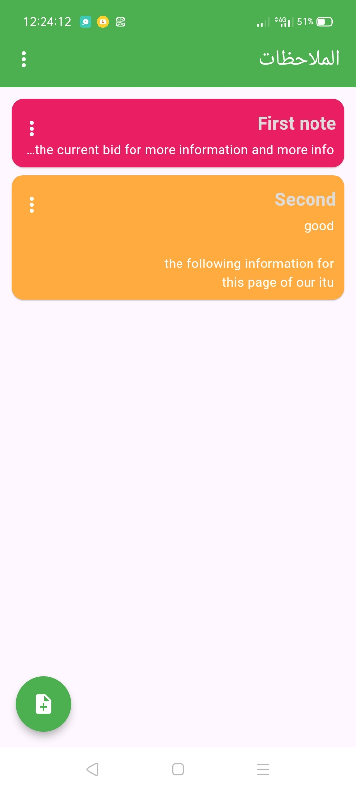

# note_app_with_get_sqfile

## Getting Started

This project is simple note app we used
teh following packages 

- sqflite   
- get
- share_plus
- shared_preferences

[!note]
> here some images from the app
## Screenshots
<table>
  <tr>
    <td></td>
    <td></td>
    <td></td>
    <td></td>
    <td></td>
    <td></td>
    <td></td>
    <td></td>
  </tr>
</table>
